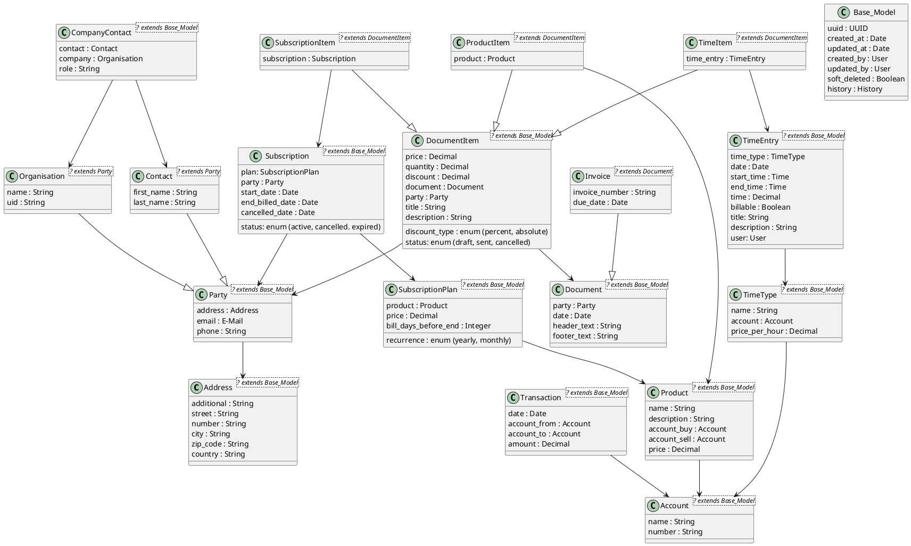

```plantuml
@startuml
class Address <? extends Base_Model> {
additional : String
street : String
number : String
city : String
zip_code : String
country : String
}

class CompanyContact <? extends Base_Model> {
contact : Contact
company : Organisation
role : String
}
CompanyContact --> Contact
CompanyContact --> Organisation

class Contact <? extends Party> {
first_name : String
last_name : String
}
Contact --|> Party

class Party <? extends Base_Model> {
address : Address
email : E-Mail
phone : String
}
Party --> Address

class Base_Model {
uuid : UUID
created_at : Date
updated_at : Date
created_by : User
updated_by : User
soft_deleted : Boolean
history : History
}

class Organisation <? extends Party> {
name : String
uid : String
}
Organisation --|> Party

class Account <? extends Base_Model> {
name : String
number : String
}

class DocumentItem <? extends Base_Model> {
price : Decimal
quantity : Decimal
discount : Decimal
discount_type : enum (percent, absolute)
document : Document
party : Party
title : String
description : String
status: enum (draft, sent, cancelled)
}
DocumentItem --> Party
DocumentItem --> Document

class SubscriptionItem <? extends DocumentItem> {
subscription : Subscription
}
SubscriptionItem --|> DocumentItem
SubscriptionItem --> Subscription

class ProductItem <? extends DocumentItem> {
product : Product
}
ProductItem --|> DocumentItem
ProductItem --> Product

class TimeItem <? extends DocumentItem> {
    time_entry : TimeEntry
}
TimeItem --> TimeEntry
TimeItem --|> DocumentItem

class TimeEntry <? extends Base_Model> {
    time_type : TimeType
    date : Date
    start_time : Time
    end_time : Time
    time : Decimal
    billable : Boolean
    title: String
    description : String
    user: User
}
TimeEntry -> TimeType

class Document <? extends Base_Model> {
    party : Party
    date : Date
    header_text : String
    footer_text : String
}

class Invoice <? extends Document> {
invoice_number : String
due_date : Date
}
Invoice --|> Document

class Product <? extends Base_Model> {
name : String
description : String
account_buy : Account
account_sell : Account
price : Decimal
}
Product --> Account

class Subscription <? extends Base_Model> {
plan: SubscriptionPlan
party : Party
start_date : Date
end_billed_date : Date
cancelled_date : Date
status: enum (active, cancelled. expired)
}
Subscription --> SubscriptionPlan
Subscription --> Party

class SubscriptionPlan <? extends Base_Model> {
product : Product
price : Decimal
recurrence : enum (yearly, monthly)
bill_days_before_end : Integer
}
SubscriptionPlan --> Product

class Transaction <? extends Base_Model> {
date : Date
account_from : Account
account_to : Account
amount : Decimal
}
Transaction --> Account

class TimeType <? extends Base_Model> {
name : String
account : Account
price_per_hour : Decimal
}
TimeType --> Account
@enduml
```