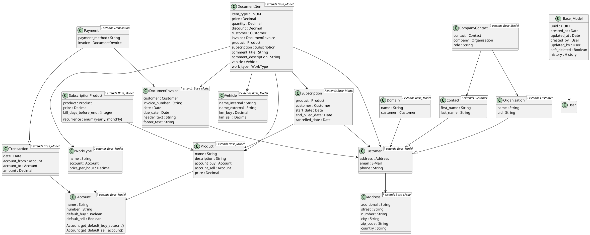

```plantuml
@startuml
class Account <? extends Base_Model> {
name : String
number : String
default_buy : Boolean
default_sell : Boolean
Account get_default_buy_account()
Account get_default_sell_account()
}

class Address <? extends Base_Model> {
additional : String
street : String
number : String
city : String
zip_code : String
country : String
}

class Base_Model {
uuid : UUID
created_at : Date
updated_at : Date
created_by : User
updated_by : User
soft_deleted : Boolean
history : History
}
Base_Model --> User

class CompanyContact <? extends Base_Model> {
contact : Contact
company : Organisation
role : String
}
CompanyContact --> Contact
CompanyContact --> Organisation

class Contact <? extends Customer> {
first_name : String
last_name : String
}
Contact --|> Customer

class Customer <? extends Base_Model> {
address : Address
email : E-Mail
phone : String
}
Customer --> Address

class DocumentItem <? extends Base_Model> {
item_type : ENUM
price : Decimal
quantity : Decimal
discount : Decimal
customer : Customer
invoice : DocumentInvoice
product : Product
subscription : Subscription
comment_title : String
comment_description : String
vehicle : Vehicle
work_type : WorkType
}
DocumentItem --> Customer
DocumentItem --> DocumentInvoice
DocumentItem --> Product
DocumentItem --> Subscription
DocumentItem --> Vehicle
DocumentItem --> WorkType

class DocumentInvoice <? extends Base_Model> {
customer : Customer
invoice_number : String
date : Date
due_date : Date
header_text : String
footer_text : String
}
DocumentInvoice --> Customer

class Domain <? extends Base_Model> {
name : String
customer : Customer
}
Domain --> Customer

class Organisation <? extends Customer> {
name : String
uid : String
}
Organisation --|> Customer

class Payment <? extends Transaction> {
payment_method : String
invoice : DocumentInvoice
}
Payment --|> Transaction
Payment --> DocumentInvoice

class Product <? extends Base_Model> {
name : String
description : String
account_buy : Account
account_sell : Account
price : Decimal
}
Product --> Account

class Subscription <? extends Base_Model> {
product : Product
customer : Customer
start_date : Date
end_billed_date : Date
cancelled_date : Date
}
Subscription --> Product
Subscription --> Customer

class SubscriptionProduct <? extends Base_Model> {
product : Product
price : Decimal
recurrence : enum (yearly, monthly)
bill_days_before_end : Integer
}
SubscriptionProduct --> Product

class Transaction <? extends Base_Model> {
date : Date
account_from : Account
account_to : Account
amount : Decimal
}
Transaction --> Account

class Vehicle <? extends Base_Model> {
name_internal : String
name_external : String
km_buy : Decimal
km_sell : Decimal
}

class WorkType <? extends Base_Model> {
name : String
account : Account
price_per_hour : Decimal
}
WorkType --> Account
@enduml
```